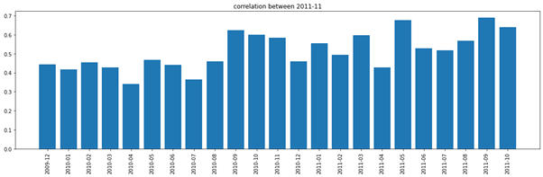
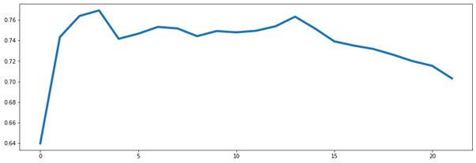
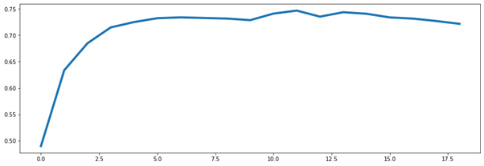
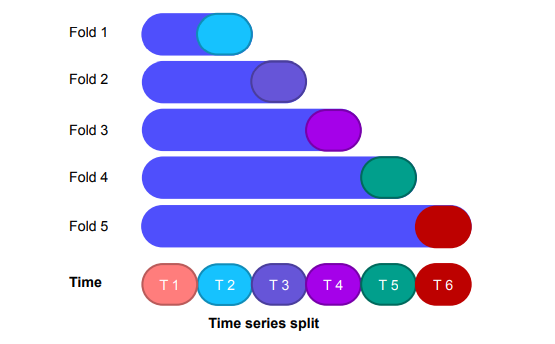

## 부스트캠프 AI Tech

# 정형 데이터 분류

> 온라인 상점 고객 구매 예측

## 개요

- 대회기간: 2021.04.12(월) ~ 2021.04.22(목)
- 팀 인원: 개인 참여
- 최종 점수:  0.8662(AUC)
- 최종 등수:  2/99
- 온라인 거래 고객 log 데이터를 이용하여 **고객들의 미래 소비를 예측**하는 분석프로젝트
- 온라인 거래 log 데이터는 2009년 12월부터 2011년 11월까지의 온라인 상점의 거래 데이터가 주어집니다.
-  2011년 11월 까지 데이터를 이용하여 **2011년 12월의 고객 구매액 300초과 여부를 예측**해야 합니다.

## 평가방법

- 평가 metric으로 AUC(Area Under Curve)를 사용합니다.

## Data

- 고객들의 구입이 이루어질 때 1개의 데이터가 생성이 되며, 데이터에는 아래와 같은 피쳐들로 2009년 12월 부터 2011년 11월 데이터까지 학습 데이터셋으로 주어집니다.
  - **고객에 대한 정보**(고객 id / 고객 거주 국가)
  - **상품 정보**(상품 id / 상품 설명 / 상품 가격)
  - **거래 정보**(주문 일자 / 상품 수량)
- 데이터 컬럼 설명
  - order_id : 주문 번호. 데이터에서 같은 주문번호는 동일 주문을 나타냄
  - product_id : 상품 번호
  - description : 상품 설명
  - quantity : 상품 주문 수량
  - order_date : 주문 일자
  - price : 상품 가격
  - customer_id : 고객 번호
  - country : 고객 거주 국가
  - total : 총 구매액(quantity X price)
- 
- **Unique Customer_id** : 5914명
- **Customer 당 로그 수** : 1개 ~ 12714개
- 5914명의 2009년 12월 ~ 2011년 11월 데이터를 이용하여 각 고객들의 2011년 12월의 총 구매액이 300을 넘을지의 확률값을 예측하는 이진 분류 문제입니다.

## Requirements

- Python >= 3.7.7
- numpy == 1.19.5
- pandas == 1.1.5
- matplotlib == 3.1.3
- seaborn == 0.11.1
- scikit-learn == 0.23.2
- scipy == 1.5.4
- xgboost == 1.3.3
- lightgbm == 3.1.1
- catboost == 0.24.4
- pytorch-tabnet == 3.1.1

## 기술적인 도전

- Data

주어진 데이터를 다 사용하지 않고 예측시점 기준 직전 12~14개월 데이터를 사용했습니다.

월별 구매액 간의 상관관계를 분석해보면 최근 달과 상관관계가 높고 전년도 같은 달과 높습니다.

[^]: 2011-11 구매액과 다른 달의 월별 구매액 간의 상관관계

1년 전에 많이 구매했던 사람과 최근에 많이 구매하는 사람 중 후자가 구매 확률이 높은 것, 작년 이맘때 무언가를 구매했다면(12월이라면 연말 용품일 수 있겠습니다.) 이번 연도 이맘때도 무언가를 구매할 확률이 크다고 생각할 수 있겠습니다.

그래서 최근 데이터를 사용하고, 전년도 같은 달을 포함하는 12~14개월 정도가 최적이라고 생각했습니다.

[^]: 사용한 데이터의 개월 수에 따른 따른 AUC의 변화

위 그림은 이전 구매액의 총합만으로 마지막 달의 구매액이 300을 넘는지 예측하는 간단한 모델로 2011-11을 예측 할 때 사용한 데이터의 개월 수에 따른 AUC의 변화를 그린 그래프입니다. 

같은 방법으로 2011-07 ~ 2011-11까지 5개월을 예측하여 평균을 내보면 아래와 같은 그래프가 그려집니다.

[^]: 2011-07 ~ 2011-11 예측 AUC의 평균 그래프

그래프를 보면 초반에는 데이터가 많아질수록 AUC가 올라가는 경향을 보이지만, 15개월 이후로는 데이터가 추가될수록 오히려 AUC가 떨어지는 경향을 보입니다.

최근 데이터가 상관관계가 높기 때문이고 12~14개월사이에서 정점을 찍는 이유는 전년도 같은 달의 상관관계역시 높기 때문으로 보입니다.

- 검증 전략

기본적으로 Stratified K-Fold전략을 사용했습니다.

초기에는 11월 데이터를 예측하는 모델을 학습시키고 12월 데이터를 예측했었는데, 2년간 데이터를 보면 11월과 12월의 데이터가 다른 양상을 보여서(9,10,11월에 구매액이 증가하다가 12월에 하락) 검증으로 쓰기에 부족하다고 생각했습니다. 

[^]: 월별 구매액 추이

그래서 TIme-Series-Split Validation을 사용해서 9월, 10월, 11월 데이터를 각각 예측하는 3개의 모델을 만들었습니다.(각각의 모델은 Stratified K-Fold사용)

- Feature

1. total, quantity, price 를 customre_id로 group_by해서 

   agg_func = ['mean','max','min','sum','count','std','skew']을 적용해서 total-sum 형식의 이름으로 피쳐를 만들었습니다.

   total-count, quantity-count와 price-count 등의 중복되는 피쳐들이 있고, 성능에 역효과가 나는 피쳐들도 만들어 졌을 수 있지만, 효율을 위해 피쳐를 하나씩 확인하여 추가하기보단 전부 추가한 후 뒤에 feature selection과정에서 제거해주기로 했습니다.

2. 마지막 주문일과 첫 주문일을 피쳐로 추가했습니다.

   마지막 주문일은 모든 피쳐중에서 feature importance가 가장 높게 나왔습니다. 최근에 구매한 사람이 또 구매할 확률이 높다는 가설이 맞다는걸 보여줬습니다.

3. total, quantity, price의 누적합과 차이(cumsum, diff)를 통해 피쳐를 만들어줬습니다.(agg_func적용)

   논리적으로 확신이 생기는 가설은 아니였지만, 예를 들어 total-diff-mean 같은 피쳐의 값이 작다면 일정한 금액을 주문했다는 것이고 정기 주문하는 도매상일 가능성이 있습니다. 이처럼 확신이 생기는 가설은 아니지만 label이 1인 피쳐와 label이 0인 피쳐의 분포가 다를 가능성이 조금이라도 있다면 모델에 넣어 판단하게 하는게 좋다고 생각했습니다. 성능은 조금 상승했습니다.

4. 예측시점에서 첫 주문일을 빼서 이용기간을 구해주고 앞에서 구한 피쳐들 중 수치형 데이터만 뽑아서 이용기간으로 나누어주었습니다.

   sum이나 count가 들어가는 피쳐들처럼 기간에 따라 달라질 수 있는 피쳐들이 있어 큰 효과를 본것 같습니다. 

5. 마지막으로 전년도 같은달과 상관관계가 높은것을 활용하고 싶어서 예측달의 12개월전의 데이터만 추린 후 total, quantity, price에 대해 agg_func을 적용해 피쳐를 만들어줬습니다.

   12개월 데이터에 없는 customer_id 들은 구매가격이 0인것과 같으므로 결측치를 0으로 채워주었습니다.

   한 달 간의 적은 데이터이므로 위에서 만든것 외에 추가로 활용해 피쳐를 만들지는 않았습니다.

- Feature selection

가장 아쉬움이 많이 남는 파트입니다. 

최종적으로 추가된 피쳐의 수가 380개정도 되어 피쳐를 제거하는 방식으로 feature selection을 시도하였습니다. 

먼저 LightGBM모델에서 기본적으로 제공하는 feature importance가 낮은 순으로 피쳐를 100개 뽑아서 모델을 돌릴때마다 380개의 피쳐에서 한개의 피쳐를 제거하고 379개의 피쳐로 학습 후 validation을 반복했습니다. 이 때 feature가 중복된 것이거나 좋지 않은 피쳐의 경우 379개의 피쳐로 학습됐을때 380개의 피쳐로 학습시켰을 때보다 오히려 AUC가 오르는 경우가 있었고, 9월, 10월, 11월 예측 모델에서 전부 AUC가 오른 피쳐들만을 골라 제거해주었습니다.

아쉽게도 모델의 성능은 피쳐 셀렉션을 진행할 때마다 오히려 감소하였는데요, 그 이유를 추측해 보자면 두 가지 가능성이 있다고 생각됩니다.  첫 번째는 9월 10월 11월 예측 모델 3개로 검증을 해서 제거했지만, 12월 예측 모델에서 쓰일 정도로 일반화가 잘되지 않았을 가능성입니다. 이 경우 더 많은 모델로 검증을 한다면 해결될 수 있겠습니다. 두 번째는 피쳐를 제거할 때 한 번에 위 조건에 맞는 피쳐를 3~10개씩 제거를 해주었습니다. 그런데 피쳐를 찾을 때는 한 개씩 찾았기 때문에 만약 3개의 중복피쳐가 있다면  한 개를 제거할 때는 성능이 올라가지만 중복 피쳐 3개 전부를 한 번에 제거하게 되면 오히려 하락이 일어날 수 있을 거 같습니다. 이 경우는 피쳐를 제거할 때도 가장 성능 향상이 높았던 피쳐를 한 개씩만 제거를 진행하던지 피쳐를 테스트할 때 여러 개의 피쳐를 제거해보면서 테스트하는 방법으로 해결해야 할 수 있겠습니다.

- model

  메인모델로 Decision Tree 기반의 LightGBM모델을 사용하였고, XGBoost, Catboost모델을 앙상블시 사용했습니다.

  

- Hyperparameter tuning

optuna 라이브러리 를 사용했습니다.

random grid 방식으로 진행됐고, 중요도가 높은 하이퍼파라미터 순으로 튜닝을 해 나가니 하이퍼파라미터를 찾는데 도움이 많이 됐습니다.

- Ensenble

메인으로 사용한 LightGBM모델과 XGBoost, Catboost모델을 앙상블 했습니다. LightGBM모델에 비해 나머지 두 모델의 Validation성능이 떨어져 가중평균을 구해서 결과를 앙상블 하였는데요, Validation 성능에 따라 가중평균을 주면 오버피팅 되어 Validation 성능만 오를 수 있다는 말을 들어서 좀 더 찾아볼 생각입니다. 그리고 앙상블은 상관관계가 적은 모델끼리 진행할때 성능향상이 높다고 알려져 있는데요, 전부 Decision Tree 기반 모델만 사용을 해서, MLP나 TabNet같은 딥러닝 기반 모델과 앙상블을 못해본게 아쉽습니다. 다음에 대회에 참여하게 되면 시도해볼 것입니다.

## 학습과정에서의 교훈

정형데이터 분석은 피쳐를 어떻게 뽑아내는지가 성능이 올라가는데 상당히 중요하다고 알고 있습니다. 그래서 문제 해결을 위해 어떤 피쳐를 뽑아낼 수 있을지 아이디어를 생각하는데 굉장히 많은 시간을 들였던 것 같습니다. 가설을 세워서 피처를 넣었을 때 실제 성능향상으로 이어지면 뿌듯함도 많이 느꼈습니다. 그래서 부족한 실력임에도, 저에게 과분한 점수를 얻을 수 있었던 거 같습니다. 앞으로 꼭 정형데이터가 아니더라도 문제 해결에 도움이 되는 어떤 아이디어가 있을까 생각하고 가설을 세우는데 노력을 많이 해볼 생각입니다.

그리고 이전 대회에서 얻은 교훈으로 최대한 실험을 빨리 시작하고 이론공부와 병행하려고 했는데 상당히 도움이 되었습니다. 확실히 코드를 돌려보고 평가를 해보면서 배우는 부분이 상당히 컸었기 때문에 다음에도 최대한 빨리 실험을 시작하면서 이론공부와 병행하도록 노력해야겠습니다.

## 마주한 한계와 도전 숙제

가장 먼저 느낀 한계는 부족한 기본기였습니다. 정형데이터를 많이 안 다뤄봤고 pandas역시 많이 안 다뤄봐서 익숙해지는데 상당히 긴 시간이 걸렸고, 베이스라인 코드를 따라 쳐보며 전부 이해하고 pandas를 사용해 정형데이터를 다루는게 익숙해질때까지 거의 첫 주가 다 지나갔습니다. 역시 기본기가 중요하다는 걸 느꼈고, 그래도 이번대회를 진행하면서 코딩실력과 pandas를 다루는 실력이 고생한 만큼 조금은 올랐을 거라고 위안을 삼았습니다.

- 도전과제

  베이스라인 코드를 기반으로 수정하거나 추가하여 파이프라인을 만들었는데,  다음 대회에서는 처음부터 끝까지 직접 파이프라인 코드를 짜는 시도를 해보겠습니다. 시간이 많이 걸리더라도 거기서 얻는 것도 분명히 있을 것으로 생각됩니다.

  그리고 역시 로그를 잘 남기는게 중요할 것 같습니다. 이번에는 리더보드에 제출할 때마다 하이퍼파라미터나 피쳐의 변화등을 간단하게만 적었는데, 다음대회부터는 실험일지를 기록하면서 실험해야겠습니다. 실험일지가 있다면, 내가 세웠던 가설이 맞았는지 틀렸는지를 시간이 흘러도 확인이 가능하기에 큰 도움이 될 것 같습니다.